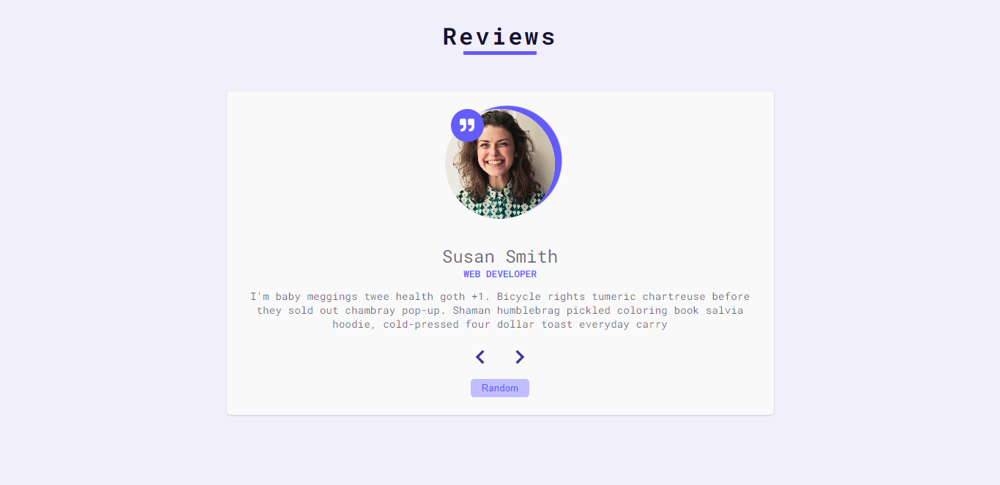

## Table of contents

- [Overview](#overview)
  - [Screenshot](#screenshot)
  - [Links](#links)
  - [Built with](#built-with)
  - [What I learned](#what-i-learned)
  - [Continued development](#continued-development)
  - [Useful resources](#useful-resources)
- [Author](#author)

## Overview

A review page that  shows reviews from different authors

### Screenshot

### Links

- Solution URL: [Add solution URL here](https://github.com/hebrohim/reactReviewPage)
- Live Site URL: [Add live site URL here](https://ibrahimreviewpage.netlify.app/)

### Built with

- ReactJs

### What I learned
1. I learnt how to use custom components in react effectively.
2. I was able to implement the useState Hook in react
3. I learnt how to transfer data from a parent component to a child component
### Continued development
integrating this page into a fully developed website
### Useful resources

- [react icon doc](https://reactjs.org/docs/hooks-state.html) - 
 
## Author

- Website -(https://github.com/hebrohim)

